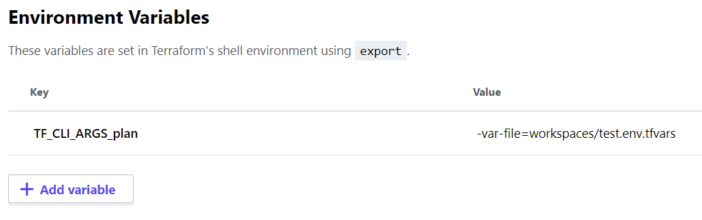

## Config

Leverage the built in use of [`<name>.tfvars`](https://www.terraform.io/docs/configuration/variables.html#variable-definitions-tfvars-files) files.

- [workspaces/**test**.env.tfvars](./workspaces/test.env.tfvars)
- [workspaces/**prod**.env.tfvars](./workspaces/prod.env.tfvars)

## Workspace variable

Modify the workspace to take in the proper `.tfvars` file.

1. Select workspace in question.
2. Navigate to `Variables`.
3. Add / Edit variables under `Environment Variables` section.
    1. Use [`TF_CLI_ARGS_plan`](https://www.terraform.io/docs/commands/environment-variables.html#tf_cli_args-and-tf_cli_args_name) as the key.
    2. The value will be the command line flag used for the cli `-var-file=workspace/test.env.tfvars`.
  
> **Warning:** You cannot use the name `terraform.tfvars` as this is reserved by TFC/TFE and any variables definded under `Terraform Variables` section will take precedence over your custom variables should they collide. 
  

## Pros & Cons

| Pros | Cons |
| ---- | ---- |
| Use variables as intended with the `.tfvars` file. | HashiCorp can always change the way this environment variable works. |
| Empowers flat file structure; no folder nesting. | |
| Less likely to fat finger and mess up variables per environment. | |
| Can version control variables and review changes through Pull Requests. | |
| Keeps variable validation. | |
| Keeps variable type checking. | |
