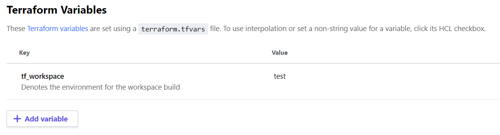

## Config file 

This approach uses `json` files to house the configuration for variables. 

- [workspaces/**test**_variables.json](./workspaces/test_variables.json)
- [workspaces/**prod**_variables.json](./workspaces/prod_variables.json)

## Load config

Leverage the built in Terraform [`jsondecode`](https://www.terraform.io/docs/configuration/functions/jsondecode.html) and [`file`](https://www.terraform.io/docs/configuration/functions/file.html) functions to load in the configuration files.

```tf
jsondecode(file("${path.root}/workspaces/<some-var-file>.json"))
```

## Interpolation

Since you can no longer use `terraform.workspace` for meaningful interpolation, you can supply your own custom variable that will denote which workspace has been chosen. In this example, that variable is defined as `variable "tf_workspace" {...}`. To supply the variable, you can simply add it into your workspace variables in Terraform Cloud/Terraform Enterprise like so.



## Interpolate workspace for config

Select proper variable file based on environment/workspace.

```tf
locals {
  workspace_variables = jsondecode(file("${path.root}/workspaces/${var.tf_workspace}_variables.json")) # evaluates to test_variables.json
}
```

## Usage

```tf
resource "random_pet" "this" {
  keepers = {
    ts = timestamp()
  }
  
  prefix = local.workspace_variables.pet_prefix # using the variable
}
```

## Pros & Cons

> These are not all inclusive.

| Pros | Cons |
| ---- | ---- |
| JSON file as configuration. Many people like this as it's very common for configuration. | Context switching; you are no longer using HashiCorp Configuration Language [(HCL)](https://www.terraform.io/docs/configuration/index.html). |
| Easily switch variables based on environment. | No variable validation. |
| Empowers flat file structure; no folder nesting. | No variable type checking. |
| Less likely to fat finger and mess up variables per environment. | |
| Can version control variables and review changes through Pull Requests. | |
