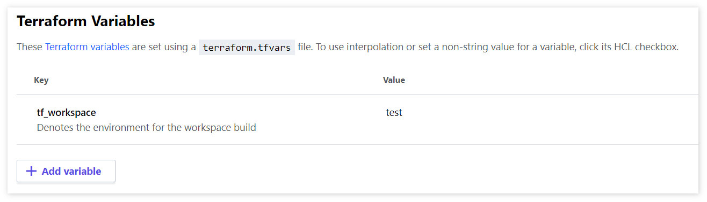

## Config

Lookup variables using built in `map[key]` function.

```tf
locals {
  pet_prefix = {
    test = "test-pet"
    prod = "prod-pet"
  }
}
```

## Workspace variable

Since you can no longer use `terraform.workspace` for meaningful input, you can supply your own custom variable that will denote which workspace has been chosen. In this example, that variable is defined as `variable "tf_workspace" {...}`. To supply the variable, you can simply add it into your workspace variables in Terraform Cloud/Terraform Enterprise like so.

1. Select workspace in question.
2. Navigate to `Variables`.
3. Add / Edit variables under `Terraform Variables` section.
    1. Make the key whatever you are using to distinguish the workspace on, e.g `tf_workspace`.
    2. Make the value the workspace, e.g, `test`.



## Usage

```tf
resource "random_pet" "this" {
  keepers = {
    ts = timestamp()
  }
  
  prefix = local.pet_prefix[var.tf_workspace] # using the variable
}
```

## Pros & Cons

> These are not all inclusive.

| Pros | Cons |
| ---- | ---- |
| Easy to see variable values based on environment without switching between files or configurations. | Requires a lookup each time you need to use a variable _(can be organized differently, but for this example you must lookup each time)_ |
| Can version control variables and review changes through Pull Requests. | Easily fat finger and mess up variables and/or edit wrong environment variables. |
|| No variable validation. |
|| No variable type checking. |
