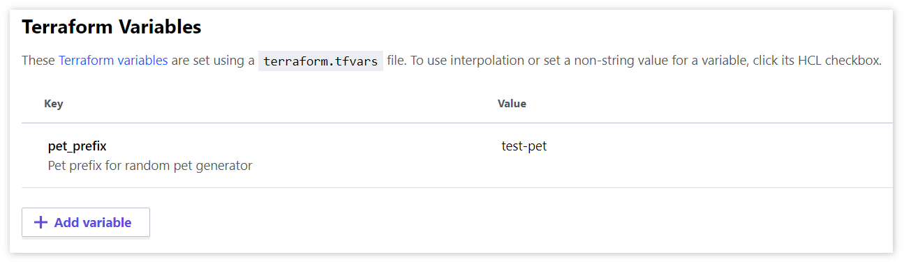

## Config

Leverage built in workspace variables in Terraform Cloud (TFC) / Terraform Enterprise (TFE). 

1. Select workspace in question.
2. Navigate to `Variables`.
3. Add / Edit variables under `Terraform Variables` section.



## Usage

```tf
resource "random_pet" "this" {
  keepers = {
    ts = timestamp()
  }
  
  prefix = var.pet_prefix # use variable
}
```

## Pros & Cons

| Pros | Cons |
| ---- | ---- |
| Works out of the box. | No versioning. |
| Easy to understand/use. | No formal change/review process such as Pull Requests. |
