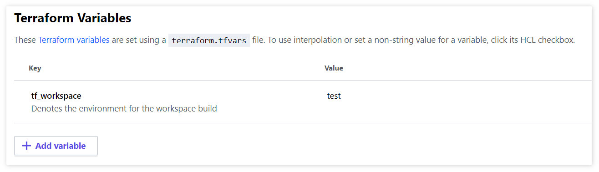

Many people I know use the popular _Terraform_ provided variable `terraform.workspace` to switch their variable configurations to the correct environment.

However, in Terraform Cloud (TFC) / Terraform Enterprise (TFE), the value of `terraform.workspace` will always evaluate to [`default`](https://www.terraform.io/docs/state/workspaces.html#workspace-internals). Below will outline how one can go about configuring the backend, selecting the workspace of choice, and evaluate a replacement variable for `terraform.workspace`.

For example, in the `workspaces` directory there are two configurations.

1. [**test**_variables.yaml](./workspaces/test_variables.yaml)
2. [**prod**_variables.yaml](./workspaces/prod_variables.yaml)

## Configuring backend

```tf
terraform {
  required_version = "~> 0.12"
  
  backend "remote" {
    hostname = "app.terraform.io"   # use your host if self hosted
    organization = "company"        # use your organization

    workspaces {
      prefix = "my-app-"            # <-- the magic, use your workspace prefix
    }
  }
}
```

## Selecting workspace

There are two main approaches to selecting a workspace in TFC/TFE. 

The first being in interactive mode. This is normally done when a user is present and needing to interact with the console, such as on your local machine.

```bash
$ terraform workspace select test
```

The second approach may be when _Terraform_ is ran in some automated fashion, such as your CI/CD pipeline.

```bash
$ export TF_WORKSPACE=test
```

### Evaluate workspace


You can get around using `terraform.workspace` by supplying your own custom variable that will denote which workspace has been selected. In this example, that variable is defined as `variable "tf_workspace {...}`. To supply the variable, you can simply add it into your workspace variables in TFC/TFE like so.



Since `test` was selected as the workspace of choice, _Terraform_ will now interpolate `${var.tf_workspace}_variables.yaml` as `test_variables.yaml`.
